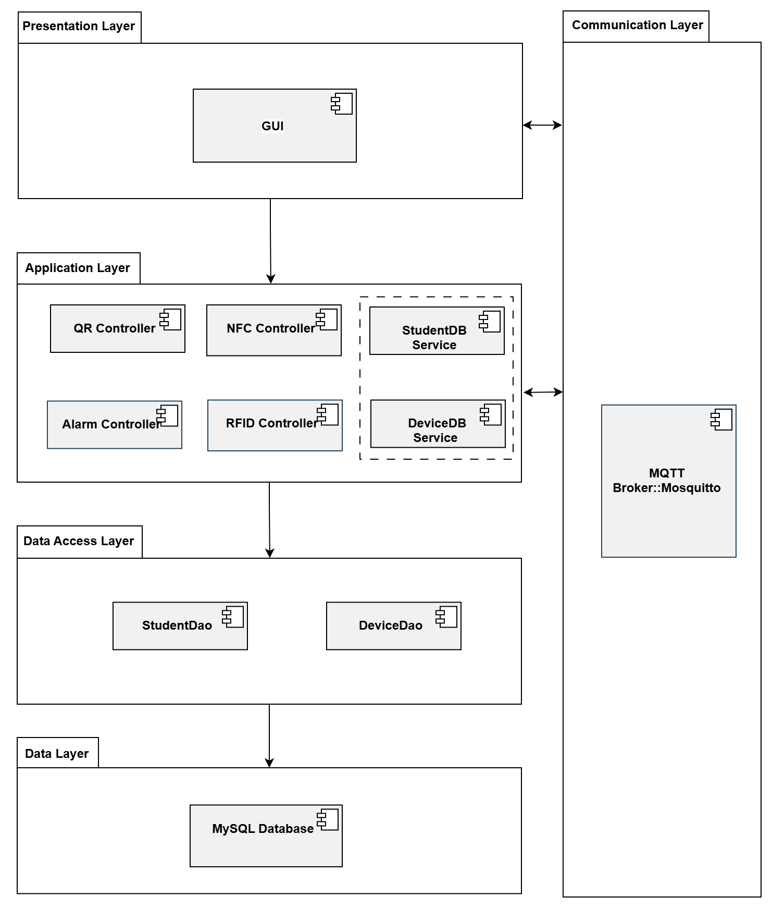
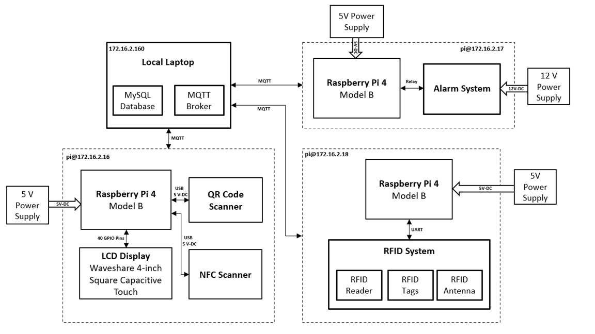

# Masterarbeit Tracking System

## Getting Started

To get started with the tracking system, configure the `config.py` file located inside the `data_layer/` directory:

```python
DATABASE_CONFIG = {
    'user': 'root',
    'password': 'define_password',
    'host': '127.0.0.1',
    'database': 'database_name'
}
```

### Raspberry Pi Credentials

The system uses three Raspberry Pi 4 devices, each configured for different functionalities. The details of each are outlined below:

#### Raspberry Pi 4: Display

- **Purpose:** Display interface for the tracking system
- **SSH Command:**
  ```bash
  ssh pi@172.16.1.16
  ```
- **Password:** 
  ```bash
  htwdisplay123
  ```
- Display will start automatically after booting.

---

#### Raspberry Pi 4: Alarm

- **Purpose:** Alarm controller for tracking system alerts
- **SSH Command:**
  ```bash
  ssh pi@172.16.1.17
  ```
- **Password:** 
  ```bash
  htwalarm123
  ```
- To start the alarm, activate the virtual environment and then start `run_alarm.sh`.
---

#### Raspberry Pi 4: RFID Scanner

- **Purpose:** RFID reader for user identification and tracking
- **SSH Command:**
  ```bash
  ssh pi@172.16.1.18
  ```
- **Password:** 
  ```bash
  htwrfid123
  ```
- To start the RFID process, start directly the script `run_rfid.sh`.

### Mosquitto Broker Configuration

To allow connections to the Mosquitto broker from remote clients, follow these steps:

1. On your Windows machine, run a text editor as administrator and paste the following text:

    ```bash
    listener 1883
    allow_anonymous true
    ```

2. This creates a listener on port 1883 and allows anonymous connections. Save the file to `"C:\Program Files\Mosquitto\"` with a `.conf` extension, for example, `your_conf_file.conf`.

3. Open a terminal window and navigate to the Mosquitto directory. Run the following command to start the broker:

    ```bash
    mosquitto -v -c your_conf_file.conf
    ```

    Where:

    - `-c`: specifies the broker config file.
    - `-v`: verbose mode to enable all logging types. This overrides any logging options given in the config file.

Make sure to activate the MySQL database service and set up the Mosquitto broker as part of your system initialization.


## Software Architecture

The system follows a modular software architecture. Below is a high-level overview:

<h1 align="center">
  
  <br>
</h1>


## Hardware Architecture

Below is a high-level overview on the hardware architecture:

<h1 align="center">
  
  <br>
</h1>
